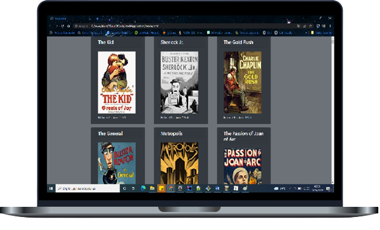

# 7DaysOfCode
Alura 7 Day Java Code Challenge ☕

## 1 - Desafio

- Fazer o seu código Java rodar e consumir a API do IMDB! Seu objetivo será imprimir os resultados de uma busca na linha de comando.
  

## Solução

Inicialmente criar uma conta no IMDB para ter a chave de acesso ao serviço (apiKey).

Criar o código Java que executará uma requisição HTTP do tipo GET e usar o pacote java.net.http e as classes HttpRequest, HttpClient, HttpResponse e URI para executar a requisição e pegar a resposta (o JSON) e imprimir o corpo da resposta no console.

Acessar o webservice ou API da plataforma em IMDB:

https://imdb-api.com/

URL para requisição: 

https://imdb-api.com/en/API/Top250Movies/<apiKey>

Retorno esperado da requisição:

{"items":[{"id":"tt5491994","rank":"1","title":"Planet Earth II","fullTitle":"Planet Earth II (2016)"…

## 2 - Desafio

- Extrair o título do filme e a URL da imagem a partir da resposta JSON.

## Solução

Existem várias maneiras de fazer isso.
A sugestão foi utilizar métodos da classe java.lang.String como substring(), split(), replace() e  Regex (através das classes Matcher e Pattern do pacote java.util.regex) para encontrar uma string que siga um determinado padrão.

Com o resultado do parseamento, deverá criar diferentes listas, cada uma com um atributo do filme. 
Uma lista com os títulos, outra com a URL da imagem e assim por diante.

Exemplo: 

 List<String> title = extractedValueListImdb(jsonFilmes, 2);

 List<String> year = extractedValueListImdb(jsonFilmes, 4);

 List<String> image = extractedValueListImdb(jsonFilmes, 5);

 List<String> imdbRating = extractedValueListImdb(jsonFilmes, 7);

Retorno esperado: 
 [The Shawshank Redemption, The Godfather, The Dark Knight, The Godfather: Part II, 12 Angry Men, Schindler's List, The Lord of the Rings: The Return of the King, Pulp Fiction, The Lord of the Rings: The Fellowship of the Ring, The Good, the Bad and the Ugly, Forrest Gump, Fight Club, Inception, The Lord of the Rings: The Two Towers, ...]
 [1994, 1972, 2008, 1974, 1957, 1993, 2003, 1994, 2001, 1966, 1994, 1999, 2010, 2002, 1980, 1999, 1990, 1975, 1995, 1954, 1946, 1991, 1998, 2002, 1997, 1999, 1977, 2014, 1991, 1985, 2001, ...]
 [https://m.media-amazon.com/images/M/MV5BMDFkYTc0MGEtZmNhMC00ZDIzLWFmNTEtODM1ZmRlYWMwMWFmXkEyXkFqcGdeQXVyMTMxODk2OTU@._V1_UX128_CR0,3,128,176_AL_.jpg, https://m.media-amazon.com/images/M/MV5BM2MyNjYxNmUtYTAwNi00MTYxLWJmNWYtYzZlODY3ZTk3OTFlXkEyXkFqcGdeQXVyNzkwMjQ5NzMamazon.com/images/M/MV5BNGMwNzUwNjYtZWM5NS00YzMyLWI4NjAtNjM0ZDBiMzE1YWExXkEyXkFqcGdeQXVyNDk3NzU2MTQamazon.com/images/M/MV5BMTY3OTI5NDczN15BMl5BanBnXkFtZTcwNDA0NDY3Mw@@._V1_UX128_CR0,3,128,176_AL_.jpg,...]
 [9.2, 9.2, 9.0, 9.0, 9.0, 8.9, 8.9, 8.9, 8.8, 8.8, 8.8, 8.8, 8.7, 8.7, 8.7, 8.7, 8.7, 8.6, 8.6, 8.6, 8.6, 8.6, 8.6, 8.6, 8.6, 8.6, 8.6, 8.6, 8.5, 8.5, 8.5, 8.5, 8.5, 8.5, 8.5, 8.5, 8.5, 8.5,...]

Observação:
Para finalizar esse desafio criei um objeto list de movie para unir os retorno.

Retorno: 
[Movies{titles='The Shawshank Redemption', urlImages='https://m.media-amazon.com/images/M/MV5BMDFkYTc0MGEtZmNhMC00ZDIzLWFmNTEtODM1ZmRlYWMwMWFmXkEyXkFqcGdeQXVyMTMxODk2OTU@._V1_UX128_CR0,3,128,176_AL_.jpg', year='1994', imDbRating='9.2'}, Movies{titles='The Godfather', urlImages='https://m.media-amazon.com/images/M/MV5BM2MyNjYxNmUtYTAwNi00MTYxLWJmNWYtYzZlODY3ZTk3OTFlXkEyXkFqcGdeQXVyNzkwMjQ5NzM@._V1_UX128_CR0,1,128,176_AL_.jpg', year='1972', imDbRating='9.2'}, Movies{titles='The Dark Knight', urlImages='https://m.media-amazon.com/images/M/MV5BMTMxNTMwODM0NF5BMl5BanBnXkFtZTcwODAyMTk2Mw@@._V1_UX128_CR0,3,128,176_AL_.jpg', year='2008', imDbRating='9.0'}, ...]

## 3 - Desafio

- Modelar, ou pelo menos iniciar uma modelagem melhor do seu código.

## Solução

Criar uma classe filme (Movie) deve ter os seguintes atributos:

- título (title)
- URL da imagem do pôster (urlImage)
- nota (rating)
- ano (year)

Agora em vez de ter várias listas diferentes, uma para cada atributo do filme, é bem melhor organizar isso em uma única List<Movie>, onde **cada filme encapsula os seus próprios dados**.

## 4 - Desafio

- Gerar uma página HTML a partir da lista de objetos que você já tem no seu código Java.

## Solução

Criar uma página HTML onde você possa ver as informações sobre o filme, incluindo o pôster, algo como:

<h1 align="center">
    
</h1>

***Passo-a-passo:***

- Crie uma nova classe HTMLGenerator, que irá receber no construtor um Writer (por exemplo, PrintWriter)
- Adicione um método chamado ‘generate’, que irá receber uma List<Movie>. Nesse método, gere todo o HTML a partir da lista, usando as informações do objeto. Você pode usar métodos privados para delegar responsabilidades.
  *(Obs: Você deve criar e fechar o Writer no método main)*

## 5 - Desafio

- Primeira tarefa neste desafio será encapsular a chamada da API dentro de uma nova classe. Você pode chamar essa classe de ImdbApiClient.
- Segunda tarefa:  Criar uma nova classe para o código que faz o parseamento do JSON. Você pode chamar essa classe de ImdbMovieJsonParser.

## Solução

Para a primeira tarefa (de encapsular a chamada da API), ela deverá ter um construtor que irá receber a chave da API e um método para executar a requisição, algo como:

String apiKey = "<sua chave>";

String json = new ImdbApiClient(apiKey).getBody(); 

E o método getBody() executará a requisição HTTP.

## 6 - Desafio

-  O seu desafio será que o **HTML seja gerado independentemente do conteúdo em questão** (seja ele um filme, uma série, uma história em quadrinhos ou outro). Você deverá deixar o seu código mais genérico, ou seja, preparado para receber dados de outras APIs. Para isso, entram em cena as **interfaces**, que permitem implementações diferentes.

  Então, vamos lá: o seu modelo deverá implementar uma nova interface que irá definir o comportamento comum de um conteúdo.

## Solução

Você pode chamá-la de Content, e ela poderá ter os seguintes métodos:

public interface Content {
  String title();
  String urlImage();
  String rating();
  String year();
}

E a sua classe (ou record) Movie se tornará um Content, dessa forma:

public class Movie implements Content {...}

Sendo assim, você também poderá pensar em uma abstração para o parser de JSON. Você pode criar uma interface chamada 'JsonParser':

public interface JsonParser{
  public List<? extends Content> parse();
}

Repare que o método devolve uma lista que possui elementos do tipo <? extends Content>. Como o Movie implementa a interface Content, esse código vai funcionar!

A partir daí, você poderá usar a nova interface JsonParser na classe ImdbMovieJsonParser:

public class ImdbMovieJsonParser implements JsonParser{
  //…
}

Resumindo, você criará duas abstrações: uma para o seu modelo chamado de Content e outra para o JsonParser. Basta que futuras implementações sigam essas interfaces e o seu gerador de HTML continuará funcionando! Ou seja, você desacoplou o parseamento do JSON da geração de HTML.

## 7 - Desafio

-  O sétimo desafio é ordenar os filmes com base em outro critério, talvez pela ordem alfabética do nome ou pelo ano.

## Solução

1. Implemente a interface Comparable<? extends Content> na classe (ou record) Movie (e também na classe Series, se você a tiver criado).
   Para começar, você pode implementar o método usando a nota (rating) como parâmetro de comparação. Por exemplo:

   public int compareTo(Content outro) {
     return this.rating().compareTo(outro.rating());
   }

   No método main, para ordenar a lista e gerar o HTML, use:

   Collections.sort(contentList);

   

2. O método sort() está sobrecarregado, então você pode passar um Comparator como segundo parâmetro para inverter a lista:

   Collections.sort(contentList, Comparator.reverseOrder());